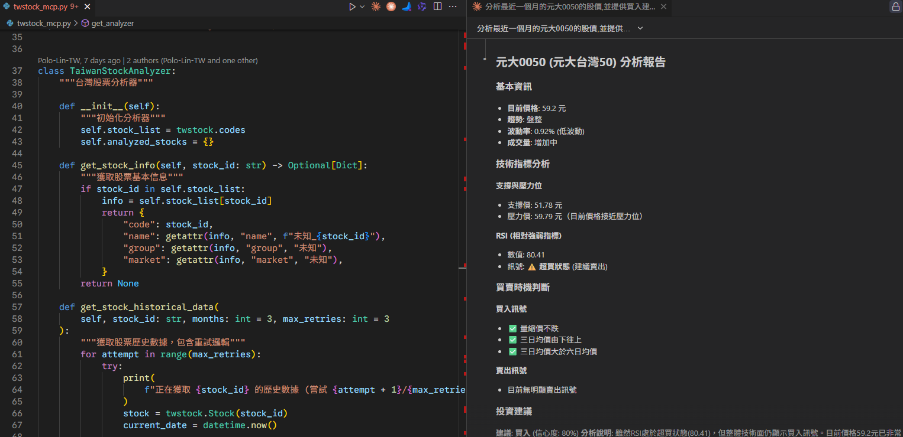

# 台灣股票分析 MCP Server

## 簡介
台灣股票趨勢與購買建議分析系統，使用 FastMCP 套件實作 Model Context Protocol (MCP) Server。此系統結合大型語言模型 (LLM) 提供智能股票分析，能根據技術指標、趨勢判斷、支撐與阻力位生成購買建議，並支持多支股票的批量分析。



## 功能展示
觀看示範影片了解系統功能：

[](media/twstock_mcp_video.mp4)

## 核心概念
此系統透過 MCP Server 與 LLM 的結合，實現以下功能：
- MCP Server 作為中介，提供股票分析工具的接口
- LLM 負責解讀使用者的自然語言指令，並調用 MCP Server 的工具進行分析
- 分析結果以結構化格式返回，供使用者進一步操作或決策

## 功能特點
- **股票基本資訊查詢**：獲取股票代碼、名稱、產業分類等基本資訊
- **單支股票分析**：分析股票的技術指標、趨勢判斷、支撐與阻力位，以及購買建議
- **批量股票分析**：一次分析多支股票，並返回分析結果列表
- **關鍵字搜尋股票**：根據股票名稱或代碼的一部分進行搜尋
- **產業分類篩選股票**：根據指定的產業分類篩選股票
- **推薦摘要**：根據分析結果生成推薦摘要，按信心度排序

## 系統需求
- Python 3.10+
- 相依套件 (見 requirements.txt)
- 使用 `uv` 管理開發環境

## 安裝步驟
1. 複製專案
```bash
git clone https://github.com/sprigga/twstock_analysis.git
cd twstock_analysis
```

2. 使用 `uv` 管理開發環境
   - 安裝 `uv`：
     ```bash
     pip install uv
     ```
   - 安裝相依套件：
     ```bash
     uv sync
     ```

## 使用說明
### 啟動 MCP Server
使用 `uv` 啟動 MCP Server：
```bash
uv run twstock_mcp.py
```

### 在 MCP Client 設置
若使用 MCP Client，請在設定檔中新增以下內容：
```json
{
  "mcpServers": {
    "taiwan-stock-analysis": {
      "command": "uv",
      "args": [
        "--directory",
        "/home/ubuntu/twstock_analysis",
        "run",
        "twstock_mcp.py"
      ]
    }
  }
}
```

### 可用工具說明

#### 1. get_stock_info
獲取股票基本資訊
```python
# 參數
stock_id: str  # 股票代碼 (例如: "2330")

# 返回格式
{
  "success": true,
  "data": {
    "code": "2330",
    "name": "台積電",
    "group": "半導體業",
    "market": "上市"
  }
}
```

#### 2. analyze_stock
分析單支股票的趨勢與購買建議
```python
# 參數
stock_id: str  # 股票代碼 (例如: "2330")
months: int = 3  # 分析幾個月的歷史資料 (預設: 3)

# 返回格式
{
  "success": true,
  "data": {
    "stock_id": "2330",
    "name": "台積電",
    "current_price": 850.0,
    "trend": "強勢上升",
    "recommendation": "買入",
    "confidence": 85,
    "support": 800.0,
    "resistance": 900.0,
    "rsi": 65.5,
    "rsi_signal": "正常",
    "macd_signal": "黃金交叉（買入）",
    "bb_signal": null
  }
}
```

#### 3. analyze_multiple_stocks
批量分析多支股票
```python
# 參數
stock_ids: List[str]  # 股票代碼列表 (例如: ["2330", "2317", "2454"])
months: int = 3  # 分析幾個月的歷史資料 (預設: 3)

# 返回格式
{
  "success": true,
  "data": {
    "results": [...],
    "errors": [...],
    "total_analyzed": 3,
    "total_errors": 0
  }
}
```

#### 4. search_stocks_by_keyword
根據關鍵字搜尋股票
```python
# 參數
keyword: str  # 搜尋關鍵字 (可以是股票名稱或代碼的一部分)

# 返回格式
{
  "success": true,
  "data": {
    "keyword": "台積",
    "results": [
      {"code": "2330", "name": "台積電", "group": "半導體業"}
    ],
    "count": 1
  }
}
```

#### 5. filter_stocks_by_industry
根據產業分類篩選股票
```python
# 參數
industry: str  # 產業分類名稱

# 返回格式
{
  "success": true,
  "data": {
    "industry": "半導體業",
    "results": [...],
    "count": 50
  }
}
```

#### 6. get_recommendation_summary
獲取多支股票的推薦摘要，按信心度排序
```python
# 參數
stock_ids: List[str]  # 股票代碼列表
months: int = 3  # 分析幾個月的歷史資料 (預設: 3)

# 返回格式
{
  "success": true,
  "data": {
    "total_analyzed": 5,
    "buy_count": 3,
    "sell_count": 1,
    "hold_count": 1,
    "buy_recommendations": [...],
    "sell_recommendations": [...],
    "hold_recommendations": [...]
  }
}
```

## 專案架構
```
twstock_analysis/
├── twstock_mcp.py           # 主程式 - MCP Server 實作
├── test_mcp.py              # 簡化測試版本
├── debug_test.py            # 除錯測試程式
├── get_honhai_data.py       # 鴻海數據獲取測試
├── requirements.txt         # 相依套件清單
├── pyproject.toml           # 專案配置
├── .mcp.json               # MCP Server 配置
├── README.md               # 說明文件
├── .gitignore              # Git 忽略檔案
├── uv.lock                 # uv 鎖定檔案
├── .python-version         # Python 版本
├── honhai_stock_data_20250926.csv  # 測試數據
└── media/                  # 媒體檔案
    ├── twstock_mcp_screenshot.png
    └── twstock_mcp_video.mp4
```

## 技術指標說明
- **RSI (相對強弱指標)**：衡量價格變動速度和幅度，值介於 0-100
- **MACD (移動平均收斂/發散指標)**：通過快慢移動平均線的交叉來判斷買賣時機
- **布林通道 (Bollinger Bands)**：根據價格標準差繪製的通道，用於判斷價格是否處於正常範圍
- **移動平均線 (MA)**：計算一定期間的平均價格，用於判斷趨勢
- **四大買點/賣點**：twstock 內建的技術分析方法

## 分析邏輯
系統使用多重技術指標進行綜合分析：
1. **趨勢分析**：基於移動平均線判斷上升/下降趨勢
2. **技術指標**：RSI、MACD、布林通道等指標分析
3. **買賣點判斷**：結合四大買賣點和技術指標訊號
4. **信心度計算**：根據多項指標綜合計算投資信心度
5. **風險評估**：計算支撐阻力位和波動率

## 開發者指南
### 新增分析工具
1. 在 `TaiwanStockAnalyzer` 類別中實作新方法
2. 使用 `@mcp.tool()` 裝飾器註冊新工具
3. 在主程式中新增相應的處理邏輯

### 測試功能
執行內建測試：
```bash
uv run python -c "from twstock_mcp import test_twstock; test_twstock()"
```

## 常見問題
1. **Q: 為什麼無法取得股票資料？**
   A: 請確認網路連線正常，且 twstock 套件設定正確。系統會自動重試獲取數據。

2. **Q: 如何自訂技術指標參數？**
   A: 可以修改 `TaiwanStockAnalyzer` 類別中相應方法中的預設參數。

3. **Q: 分析結果的準確性如何？**
   A: 此系統僅供參考，不構成投資建議。請結合其他資訊進行投資決策。

## 貢獻指南
1. Fork 此專案
2. 建立特性分支 (`git checkout -b feature/AmazingFeature`)
3. 提交變更 (`git commit -m 'Add some AmazingFeature'`)
4. 推送至分支 (`git push origin feature/AmazingFeature`)
5. 開啟 Pull Request

## 授權條款
本專案採用 MIT 授權條款

## 作者
- [sprigga](https://github.com/sprigga)

## 致謝
- [twstock](https://github.com/mlouielu/twstock) - 台灣股票數據獲取套件
- [FastMCP](https://github.com/microsoft/FastMCP) - MCP Server 框架
- [TA-Lib](https://github.com/mrjbq7/ta-lib) - 技術分析套件
- [pandas](https://pandas.pydata.org/) - 數據處理套件
- [matplotlib](https://matplotlib.org/) - 圖表繪製套件
